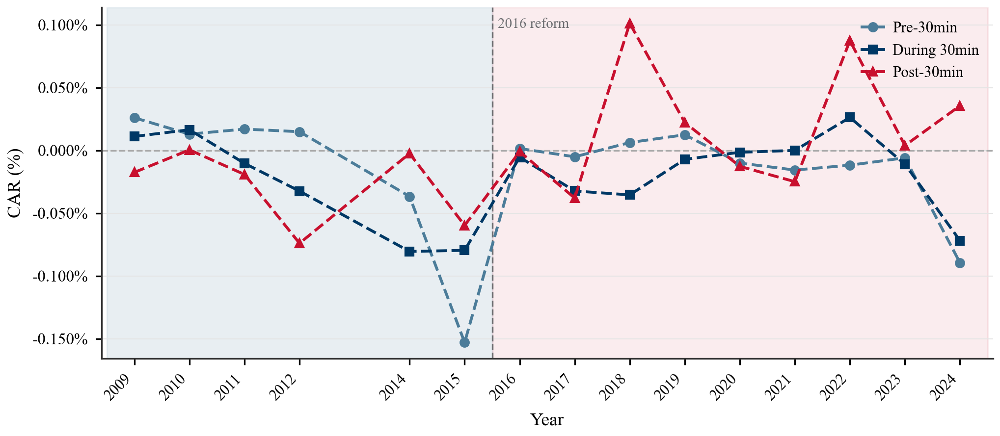

# 如果你也和我一样讨厌Tex——markdown+word的毕设解决方案
## 前言

楼主真的非常讨厌Tex，在大二大模型还没那么成熟的时候曾对着史一样的编译问题和莫名其妙的宏包管理痛哭，那个时候就发誓再也不自己写tex。

到了大四写毕设的时候，楼主就试着在markdown里写作，基于pandoc转换成word的方式来完成了毕设。发现整体体验还不错，在此分享给大家：

### 楼主认为这个方案有这几个优势：

- 最单纯的python-pandoc的环境，不用处理任何latex

- 格式和内容完全分离，在文档中就专注内容本身，渲染完全由render.py来完全定义格式

- 写作中基于markdown preview的草稿查看（其实markdown中没有任何格式定义和外包裹，基本上所见即所得，不太需要草稿预览），成果基于word引擎的极快速渲染查看

- 一篇文章往往95%的部分是固定格式，5%的部分是需要进行自定义调整的，而往往这5%占用了70%的精力去调整。如果完全使用代码的形式调整自定义格式将非常痛苦，如果能够把自定义排版的部分完全交由Word来进行调整，可能会更符合操作直觉。

### 此方案适合：

- 有Python环境，或者不介意安装Python环境

- 对于自定义格式要求不多，不介意最后使用Word微调排版

- 因为代理封禁、模型能力较差暂时无法大批量一次性生成tex语句

### 楼主认为这个方案的局限性有：

- 如果你已经有Quarto的使用基础，仓库里有定义好样式的Word模板，qmd应该比这个好用一些，可以不用我这里源生的markdown pandoc转换。

- 如果你非常熟悉Tex，[https://github.com/sjtug/SJTUThesis](https://github.com/sjtug/SJTUThesis)是经过非常多年积累的项目，应该bug更少，渲染效果更接近学校要求。

---

## 快速开始

### 1. 环境准备

你需要安装以下两个依赖：

| 依赖 | 说明 | 安装方式 |
| --- | --- | --- |
| **Python 3.8+** | 运行渲染脚本 | [python.org](https://www.python.org/) 或 Anaconda |
| **Pandoc 3.0+** | Markdown → Word 核心转换引擎 | `conda install -c conda-forge pandoc` 或 [pandoc.org](https://pandoc.org/installing.html) |
| **python-docx** | Word 文档后处理 | `pip install python-docx` |

> **推荐**：使用 conda 创建一个独立环境，例如 `conda create -n pandoc python=3.11 pandoc`，脚本会自动检测 `envs/pandoc/` 下的 pandoc。

### 2. 填写论文信息

打开 `101-setup.md`，按照表格中第三列填写你的个人信息和论文标题：

```markdown
| 需填写字段 | 模板字段内容（用于对照填写，请勿修改） | 填写字段内容（用于填写和修改）   |
| ---------- | ------------ | ---|
| 姓名   | 张三 | <你的姓名>  |
| 学号   | 520XXXXXXXX | <你的学号> |
| ...    | ...  | ...  |
```

脚本会自动读取此表格，将模板封面中的占位文字替换为你填写的内容。

### 3. 撰写论文

在 `md/` 目录下编辑 Markdown 文件。文件按文件名排序后合并渲染，命名约定如下：

| 文件名 | 内容 | 对应模板节 |
| --- | --- | --- |
| `201-abstract.md` | 中英文摘要 & 关键词 | §2（摘要） |
| `301-introduction.md` | 绪论 | §3（正文） |
| `302-format.md` | 正文章节… | §3（正文） |
| `303-data.md` | 正文章节… | §3（正文） |
| `304-conclusion.md` | 结论 | §3（正文） |
| `401-reference.md` | 参考文献（占位符，自动生成） | §4（附录/尾部） |
| `402-appendix.md` | 附录 | §4（附录/尾部） |
| `403-achievement.md` | 攻读学位期间发表的学术论文 | §4（附录/尾部） |
| `404-acknowledgement.md` | 致谢 | §4（附录/尾部） |
| `501-summary.md` | 大摘要（如需要） | §5（隐藏标题） |

> **命名规则**：文件名前缀的第一个非零数字（如 `3xx` → 3）决定该章属于模板的哪个节（§），从而应用对应的页眉页脚。你可以按需增删 `3xx-*.md` 文件来添加正文章节。

### 4. 一键渲染

```bash
python render.py
```

即可在当前目录生成 `SJTUThesis.docx`。

#### 更多用法

```bash
python render.py                     # 默认：中文 docx，数字引用格式
python render.py docx-en             # 英文版 docx
python render.py --csl=note          # 脚注式引用
python render.py --csl=author-date   # 作者-年份式引用
```

### 5. Word 微调

渲染完成后，用 Word 打开 `SJTUThesis.docx`，Word 会自动更新目录和编号域。你可以在此基础上做最后的排版微调（如调整个别图片大小、续表题注等）。

---

## 项目结构

```
SJTUThesis-Word/
├── render.py                  # 核心渲染 & 后处理脚本
├── 101-setup.md               # 论文元信息配置（姓名、学号、标题等）
├── 401-reference.bib          # BibTeX 参考文献库
├── china-national-standard-gb-t-7714-2015-*.csl   # GB/T 7714 引用样式（3种）
│
├── md/                        # ★ 论文正文 Markdown 文件（按文件名排序合并）
│   ├── 201-abstract.md
│   ├── 301-introduction.md
│   ├── 302-format.md
│   ├── 303-data.md
│   ├── 304-conclusion.md
│   ├── 401-reference.md       # 参考文献占位符（由 citeproc 自动填充）
│   ├── 402-appendix.md
│   ├── 403-achievement.md
│   ├── 404-acknowledgement.md
│   └── 501-summary.md
│
├── image/                     # 图片资源目录
│   └── 303-data/              # 按章节组织的子目录
│
├── template/                  # Word 参考模板（定义全部样式）
│    ├── 中文毕业设计模板260507.docx
│   └── 英文毕业设计模板250928.docx
│
└── SJTUThesis.docx            # 渲染输出
```

---

## Markdown 写作指南

### 标题层级

使用标准 ATX 标题，`render.py` 会自动映射到 Word 样式：

```markdown
# 章标题         → Heading 1 / 非编号章节标题
## 节标题        → Heading 2
### 小节标题     → Heading 3
```

### 图片

```markdown

```

- 图片描述文字会自动成为图题注（"图 1 图片描述文字"）
- 图片会被自动转换为**上下型环绕**（居中显示）

### 表格

使用标准 Markdown 管道表格：

```markdown
: 这是表格标题

| 列A | 列B | 列C |
| --- | --- | --- |
| 数据1 | 数据2 | 数据3 |
```

- 表格会被自动应用**三线表**样式
- 表格前的标题行会被转换为题注（"表 1 这是表格标题"）
- 单元格文字会被应用**表格**段落样式

### 公式

行内公式用 `$...$`，独立公式用 `$$...$$`：

```markdown
行内引用 $E = mc^2$ 可以直接写在段落中。

$$
Y_i = \alpha + \sum_{k=1}^{K} \beta_k \cdot PC_k^i + \gamma \cdot \mathbf{Z}_i + \delta_t + \varepsilon_i
$$
```

独立公式会被自动编号（右对齐序号 `(1)`, `(2)`, …），并应用**公式**样式。

### 参考文献引用

在正文中使用 `[@citekey]` 引用 `401-reference.bib` 中的文献：

```markdown
论文正文是主体，一般由标题、文字叙述、图、表格和公式等部分构成[@Zhang1998]。
```

引用会自动按 GB/T 7714 格式生成，参考文献列表会自动插入到 `401-reference.md` 的占位符位置。

### 关键词

在摘要末尾写明关键词，会被自动识别并应用**关键词**样式：

```markdown
**关键词**：学位论文，论文格式，规范化，模板

**Keywords**: dissertation, dissertation format, standardization, template
```

### 图表注释

以"注："或"Note:"开头的段落会被自动应用**图表注**样式：

```markdown
注：所有连续控制变量在进入回归模型前均已在 1% 和 99% 分位数处进行缩尾处理。
```

---

## render.py 后处理详解

`render.py` 在调用 Pandoc 生成初始 `.docx` 后，会自动执行以下后处理步骤：

| 步骤 | 功能 | 说明 |
| :---: | --- | --- |
| 1 | **三线表样式** | 所有表格应用"三线表"样式，单元格段落应用"表格"样式 |
| 2 | **表格题注** | 在每个表格上方插入"表 N …"格式的题注（带 SEQ 自动编号域） |
| 3 | **图片题注** | 在每张图片下方插入"图 N …"格式的题注（带 SEQ 自动编号域） |
| 4 | **清理多余标题** | 移除 Pandoc 残留的 ImageCaption 段落 |
| 5 | **上下型环绕** | 将所有行内图片转换为锚定图片（上下型环绕，居中） |
| 6 | **参考文献样式** | 参考文献列表段落应用"列表段落（无编号）"样式 |
| 7 | **图表注样式** | "注："/"Note:"开头的段落应用"图表注"样式 |
| 8 | **目录重定位** | 将 Pandoc 生成的目录移到摘要与正文之间，标题改为"目 录" |
| 9 | **封面注入** | 从模板复制封面、英文封面、原创性声明等页面，并用 `101-setup.md` 的信息替换占位文字 |
| 10 | **分节符** | 按章节插入分节符，每节继承模板对应节的页眉页脚 |
| 11 | **分页符** | 每个一级标题前插入分页符（如果前面没有分节符的话） |
| 12 | **公式编号** | 独立公式自动居中并右对齐编号 (1), (2), … |
| 13 | **关键词样式** | "关键词："/"keywords:"开头的段落应用"关键词"样式 |
| 14 | **自动更新域** | 设置 `updateFields=true`，Word 打开时自动刷新目录和编号 |

---

## 常见问题

### Q: 渲染后打开 Word 弹出"是否更新域"的提示？

**A:** 点击"是"。这是 `render.py` 设置的，让 Word 自动更新目录页码和图表编号。

### Q: 如何添加新的正文章节？

**A:** 在 `md/` 目录下新建 `3xx-章节名.md` 文件（如 `305-model.md`），文件会按名称排序自动合并到正文中。前缀 `3` 表示属于正文节（§3），使用正文的页眉页脚。

### Q: 参考文献怎么管理？

**A:** 在 `401-reference.bib` 中添加 BibTeX 条目，在正文中用 `[@citekey]` 引用即可。`render.py` 使用 Pandoc 的 `--citeproc` 自动处理引用和参考文献列表，默认采用 GB/T 7714-2015 数字编号格式。

### Q: 图片放在哪里？

**A:** 放在 `image/` 目录下。建议按章节建子目录（如 `image/303-data/`），在 Markdown 中用相对路径引用。

### Q: 我想修改 Word 模板样式怎么办？

**A:** 直接修改 `template/中文毕业设计模板260507.docx` 中的样式定义（字体、行距、缩进等）。`render.py` 使用 `--reference-doc` 参数继承模板的全部样式。

### Q: 能生成 PDF 吗？

**A:** 当前版本专注于 Word 输出。如果需要 PDF，建议渲染出 Word 后直接用 Word 导出 PDF，可以保证格式一致性。

---

## 致谢

- [Pandoc](https://pandoc.org/) — 万能文档转换器
- [python-docx](https://python-docx.readthedocs.io/) — Python Word 文档处理库
- [SJTUThesis (LaTeX)](https://github.com/sjtug/SJTUThesis) — 上海交通大学学位论文 LaTeX 模板
- GB/T 7714-2015 CSL 样式来自 [citation-style-language/styles](https://github.com/citation-style-language/styles)
